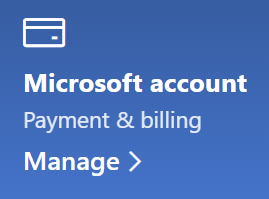

# Endre Microsoft-kontoinformasjonen

Gå til [https://account.microsoft.com](https://account.microsoft.com/) og logg på om nødvendig. Dette tar deg til instrumentbordet for kontoen.  

**Redigere navn og personlig informasjon**

1. Klikk på de tre prikkene (flere handlinger) ved siden av kontobildet og navnet på kontoinstrumentbordet > Rediger profil**.
2. Bruk koblingene som medfølger på **Rediger profil**-siden, for å endre innstillinger for profilbilde, navn, fødselsdato, plassering, og visningsspråk. Legg merke til koblingene til Xbox- eller Skype-kontoprofilene, hvor du kan endre informasjonen som er spesifikk for disse kontoene.

**Administrere e-postadresser og telefonnumre**

En Microsoft-konto har én eller flere e-postadresser eller telefonnumre tilknyttet som «aliaser». Slik administreres disse:

1. Klikk de tre prikkene (flere handlinger) ved siden av kontobildet og navnet på kontoinstrumentbordet ved siden **av** kontobildet > ditt.
2. Klikk på **Administrer hvordan du logger på Microsoft** på **Rediger profil**-siden. 
3. Du ser en liste over kontoaliaser, og du kan administrere listen, inkludert legge til og slette e-postadresser og telefonnumre. Her kan du også velge hvilke aliaser som kan brukes til å logge på kontoen, og hvilke aliaser som anses som «primære», som vises på Windows 10-enhetene.

**Administrere betalingsmetoder, samt navn og adresse for fakturering** 

1. Klikk de tre prikkene (flere handlinger) ved siden av kontobildet og navnet på kontoinstrumentbordet ved siden **av** kontobildet > ditt.
2. Klikk på **Administrer** under **Betaling og fakturering**..

    

3. Her kan du legge til, redigere og fjerne betalingsmetoder og tilknyttede faktureringsadresser. 
