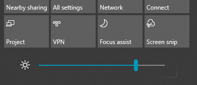

# Endre skjermlysstyrken i Windows 10

Hvis Windows 10 er nyere enn versjon 1903, har den en glidebryter for lysstyrke i handlingssenteret.  Hvis du vil åpne  handlingssenteret, klikker du Varsling-knappen på høyre side av oppgavelinjen, eller trykker **Windows home + A** på tastaturet.

Hvis Windows 10 er en tidligere versjon, kan du finne glidebryteren for lysstyrke ved å gå til Innstillinger **[> System > Display](ms-settings:display?activationSource=GetHelp)**.

**Notater:**

- Det kan hende du ikke ser glidebryteren Endre lysstyrke for den innebygde skjerm på stasjonære PC-er som har en ekstern skjerm. Hvis du vil endre lysstyrken på en ekstern skjerm, bruker du kontrollene på skjermen.
- Hvis du ikke har en stasjonær PC og glidebryteren ikke vises eller fungerer, kan du prøve å oppdatere skjermdriveren. Skriv inn Enhetsbehandling i søkeboksen på **oppgavelinjen,** og velg deretter **Enhetsbehandling** fra listen over resultater. Velg **Skjermkort i Enhetsbehandling** **,** og velg deretter skjermkortet. Trykk og hold (eller høyreklikk) navnet på skjermkortet, og klikk **Oppdater driver**. deretter følger du instruksjonene.
