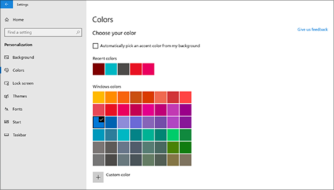
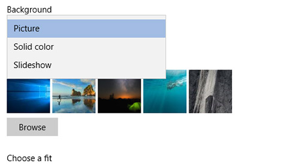

# Endre skrive bords bakgrunn og farger

Hvis du vil endre farge innstillingen, går **Start**du til  >  **Settings**  >  **tilpasnings**  >  **farger**for start innstillinger og velger deretter din egen farge, eller du kan la Windows trekke en aksent farge fra bakgrunnen.

Hvis du vil endre skrive bords bakgrunnen, går **du til**  >  **Settings**  >  **Personalization**  >  **bakgrunns**innstillinger for tilpasning, og deretter velger du et bilde, en hel dekkende farge eller oppretter en lysbilde fremvisning av bilder. 

Vil du ha flere skrive bords bakgrunner og farger? Gå til [Microsoft store](https://www.microsoft.com/store/collections/windowsthemes) for å velge mellom dusinvis av gratis temaer.
