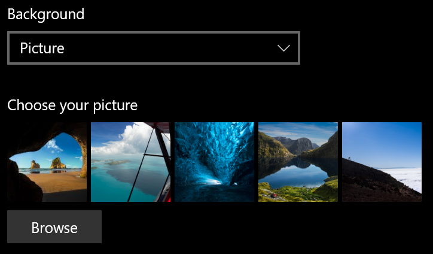
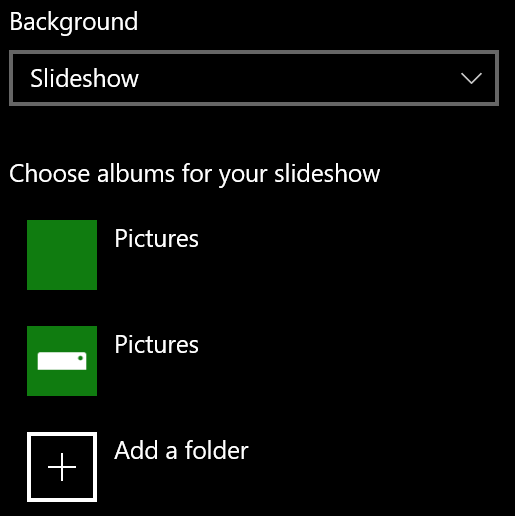

# Endre låseskjermbakgrunnenChange your lock screen background

- Gå til **Skjermbildet Innstillinger** > **PersonaliseringSlås** > \*\*\*\*.Go to **Settings** > **Personalization** > **Lock screen**. Eller klikk eller trykk [her](ms-settings:lockscreen?activationSource=GetHelp).Or click or tap [here](ms-settings:lockscreen?activationSource=GetHelp).

- Hvis du vil angi et egendefinert bakgrunnsbilde, velger du **Bilde** fra rullegardinlisten **Bakgrunn** og velger eller **blar til** bildet.To set a custom background picture, select **Picture** from the **Background** drop-down list, and choose or **Browse** to the picture.

  

- Hvis du vil konfigurere en lysbildefremvisning av egendefinerte bilder, velger du **Lysbildefremvisning** fra rullegardinlisten **Bakgrunn** og velger et album eller legger til en mappe som inneholder bildene for lysbildefremvisningen.To set up a slideshow of custom pictures, select **Slideshow** from the **Background** drop-down list, and choose an album or add a folder that contains the pictures for the slideshow.

  
