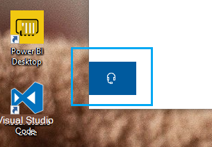

# Kontakt oss ved å klikke på hodetelefonknappen

Hvis du vil kontakte Microsoft kundestøtte, klikker du **på Kontakt oss** nederst til venstre i denne appen. Inne i fly-out-vinduet vil du bli guidet til riktig støttekanal etter at du har valgt produkt- og problemkategorien.

Du kan fortsette å samhandle med resten av appen selv etter at du har startet en Kontakt oss-økt. Kontakt oss-panelet kan minimeres midlertidig ved å klikke et annet sted i appen. Hvis du vil gå tilbake til samme økt, klikker du bare **på Kontakt oss** på nytt.
