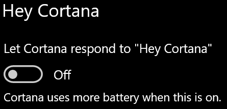

# Cortana snakker ikke til meg eller kan ikke høre meg

Hvis du prøver å bruke “Hei, Cortana”-funksjonen, som gjør at du kan snakke til Cortana uten å velge Cortana-knappen på oppgavelinjen eller mikrofonknappen på Cortana-panelet, må du bekrefte at funksjonen er aktivert:

1. Gå til **Start**, og velg deretter **[Innstillinger > Cortana](ms-settings:cortana?activationSource=GetHelp)**.
2. Sett veksleknappen **La Cortana svare på “Hei, Cortana”** til **På**, under **Hei, Cortana**.

**Hindrer personverninnstillingene at Cortana hører deg?**

Personverninnstillingene kan hindre Cortana i å svare stemmen din.
- Kontroller at elektronisk talegjenkjenning er aktivert:
    - Gå til **Start**, og klikk på **[Innstillinger > Personvern > Tale](ms-settings:privacy-speech?activationSource=GetHelp)**.
    - Endre innstillingen til **På** under **Elektronisk talegjenkjenning**.
- Kontroller at Cortana har tilgang til mikrofonen. 
    - Gå til Start, og klikk deretter på **[Innstillinger > Personvern > Mikrofon](ms-settings:privacy-microphone?activationSource=GetHelp)**.
    - Se etter **Cortana** i listen over apper og tjenester, under **Velg hvilke apper som har tilgang til mikrofonen**, og kontroller at bryteren er satt il **På**.

Kontroller også at høyttalerne eller mikrofonen er oppe og går, for å kunne snakke til Cortana.
