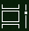

# Gjør mer med fleroppgavekjøring i Windows 10Do more with multitasking in Windows 10

Hvis du vil se eller bytte  mellom apper, kan du klikke Oppgavevisning-knappen på oppgavelinjen, eller trykke **ALT-TAB** på tastaturet.To see or switch between apps: you can click the **Task View** button in the taskbar, or press **Alt-Tab** on your keyboard. Oppgavevisning-knappen ser slik ut:The Task View button looks like this:

Hvis du enkelt vil ordne to apper side ved side, kan du bruke Snapassistent: Ta tak i toppen av et appvindu og dra det til den ene siden for å «feste» den til den halvdelen av skjermen.To easily arrange two apps side by side, use Snap Assist: grab the top of an app window and drag it to one side to "snap" it to that half of the screen. Velg deretter en annen app, og den festes automatisk på plass i den andre halvdelen av skjermen.Then choose another app and it will automatically snap into place in the other half of the screen.

**Slik oppretter du forskjellige virtuelle skrivebord for hjemmebruk og arbeid:****To create different virtual desktops for home and work**:

1. Klikk **Oppgavevisning-knappen** på oppgavelinjen, eller trykk **ALT-TAB** på tastaturet.Click the **Task View** button in the taskbar, or press **Alt-Tab** on your keyboard.
2. Klikk **+ Nytt skrivebord** (øverst til venstre på skjermen mens du er i oppgavevisning).Click **+ New Desktop** (located at the top left of your screen while in task view).
3. Åpne appene du vil bruke.Open the apps you want to use. 

Gå tilbake til **Oppgavevisning for** å se skrivebordene og veksle mellom dem.Go back to **Task View** to see your desktops and switch between them.
