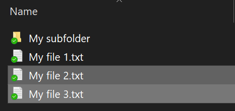
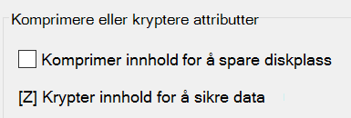

# Kryptere filer eller mappe i Windows 10Encrypt files or folder in Windows 10

Du kan kryptere en hel disk ved hjelp av BitLocker, men for å kryptere bare individuelle filer eller mapper (og innholdet deres):You can encrypt an entire disk using BitLocker, but to encrypt only individual files or folders (and their contents):

1. I **Filutforsker** velger du filen(e)/mappen(e) du vil kryptere.In **File Explorer**, select the file(s)/folder(s) you want to encrypt. I dette eksemplet er to filer valgt:In this example, two files have been selected:

    

2. Høyreklikk de merkede filene, og klikk **Egenskaper**.Right-click the selected files and click **Properties**.

3. Klikk Avansert **i** **Egenskaper-vinduet.**In the **Properties** window, click **Advanced**.

4. Merk av **for** Krypter innhold for å sikre **data** i Avanserte egenskaper-vinduet:In the **Advanced Properties** window, select the **Encrypt contents to secure data** checkbox:

    

5. Klikk **OK**.Click **OK**.
