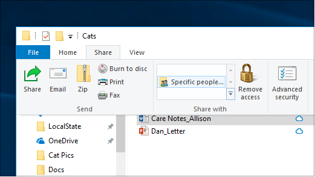
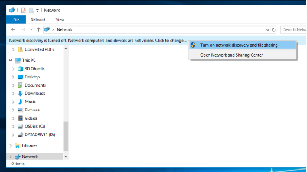

# Fil deling over et nettverk i Windows 10File sharing over a network in Windows 10

**Obs**! hvis du tidligere brukte hjemmegruppe for fil deling, må du være oppmerksom på at Hjemmegruppe er fjernet fra Windows 10 (versjon 1803).**Note**: If you previously used HomeGroup for file sharing, please note that HomeGroup has been removed from Windows 10 (Version 1803). Nå kan du dele skrivere og filer ved hjelp av innebygde funksjoner i Windows 10.You can now share printers and files by using built-in features in Windows 10.

**Dele filer eller mapper via et nettverk****To share files or folders over a network**

- I **fil Utforsker**velger du en fil > klikker **del** -fanen øverst > i delen **del med** , klikker du **bestemte personer**.In **File Explorer**, select a file > click the **Share** tab at the top > in the **Share with** section, click **Specific people**.

    
          
- Hvis du velger flere filer samtidig, kan du dele dem på samme måte.If you select multiple files at once, you can share them all in the same way. Det fungerer for mapper også.It works for folders, too.

**Slik viser du enheter på nettverket som deler filer****To see devices on the network that are sharing files**

- Gå til **nettverk**i **fil Utforsker**.In **File Explorer**, go to **Network**. Hvis nettverks gjenkjenning ikke er aktivert, vil du se en feil melding om at nettverks gjenkjenning er slått av...If Network discovery is not enabled, you will see an error message "Network discovery is turned off..."

- Klikk **nettverks gjenkjenning er deaktivert** banneret, og klikk deretter **Aktiver nettverks gjenkjenning og fil deling**.Click the **Network discovery is turned off** banner, then click **Turn on network discovery and file sharing**.

    

[Les mer om fil deling over et nettverkRead more about file sharing over a network](https://support.microsoft.com/help/4092694/windows-10-file-sharing-over-a-network)

[Dele filer ved hjelp av apper, OneDrive, e-post og merShare files using apps, OneDrive, emails, and more](https://support.microsoft.com/help/4027674/windows-10-share-files-in-file-explorer)
