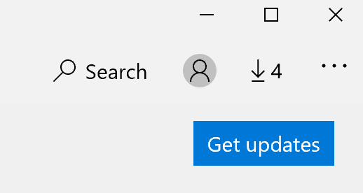

# Løse skjermspråket for apper

Når du har endret visningsspråket i Windows 10, kan det hende at noen apper fremdeles bruker det forrige språket når du åpner dem. Dette skjer fordi nye versjoner av appene for dette språket må lastes ned fra Store. Hvis du vil løse dette problemet, kan du enten vente på den automatiske oppdateringen, eller du kan installere den oppdaterte versjonen av appene manuelt.

Hvis du vil installere oppdateringen manuelt, **åpner du Microsoft Store** og klikker **Nedlastinger** og oppdateringer øverst til høyre. Klikk deretter **Få oppdateringer**. Hvis språket ikke endres etter at oppdateringen er fullført, kan du prøve å starte PC-en på nytt.

Hvis du vil lese mer om innstillinger for inndata- og visningsspråk, kan du se Administrere innstillinger for inndata- og [visningsspråk i Windows 10](https://support.microsoft.com/help/4027670/windows-10-add-and-switch-input-and-display-language-preferences).
