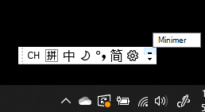
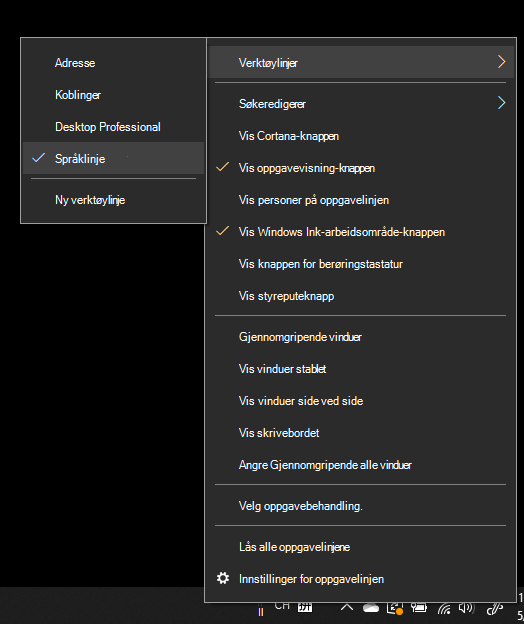
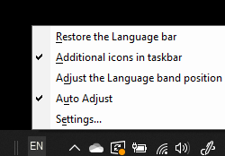

# Skjule, vise eller tilbakestille språklinjen

**Slik minimerer du språklinjen:**

Du kan klikke minimeringsknappen øverst til høyre på språklinjen. Du kan også bare dra språklinjen til oppgavelinjen, som minimerer den automatisk.

**Slik viser du språklinjen:**

Hvis du ikke vil forankre språklinjen på oppgavelinjen, høyreklikker du et tomt  område på oppgavelinjen og fjerner merket for Språklinje på Verktøylinjer-menyen. Dette gjør at språklinjen vises utenfor oppgavelinjen, akkurat som det forrige skjermbildet.

**Slik gjenoppretter du språklinjen til standard:**

Høyreklikk språkknappen på verktøylinjen, og klikk Gjenopprett **språklinjealternativet** i menyen. Dette gjenoppretter den til standard.

