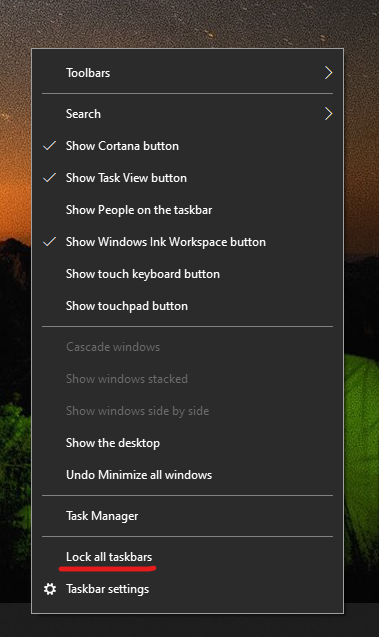

# Flytte oppgavelinjen til en av sidene eller øverst på skrivebordetMove the taskbar to either side or the top of your desktop

Først må du bekrefte at oppgavelinjen er ulåst.First, please confirm that the taskbar is unlocked. Hvis du vil finne ut om din er ulåst, høyreklikker du et tomt område på oppgavelinjen og ser om Lås oppgavelinjen har en hake ved siden av seg. To find out whether yours is unlocked, right-click any empty space on the taskbar and see whether **Lock the taskbar** has a checkmark next to it. Hvis det er en hake, er oppgavelinjen låst og kan ikke flyttes.If there is a checkmark, the taskbar is locked and cannot be moved. Når du **klikker Lås oppgavelinjen én** gang, låses den opp og haken fjernet.Clicking **Lock the taskbar** once will unlock it and remove the checkmark.

Hvis du har flere skjermer som viser oppgavelinjen, ser du **Lås alle oppgavelinjene**.If you have multiple monitors that display the taskbar, you will see **Lock all taskbars**.

Når oppgavelinjen er ulåst, kan du trykke og holde et tomt område på oppgavelinjen og dra den til ønsket plassering på skjermen.Once the taskbar is unlocked, you can press and hold any empty space on the taskbar and drag it to the location you want on the screen. Du kan også gjøre dette ved å høyreklikke på et tomt område på oppgavelinjen og gå til Innstillinger for oppgavelinjen > ** oppgavelinjeplasseringen på skjermen**.You can also do so by right-clicking on any empty space on the taskbar and go to **[Taskbar settings](ms-settings:taskbar?activationSource=GetHelp) > Taskbar location on screen**.
