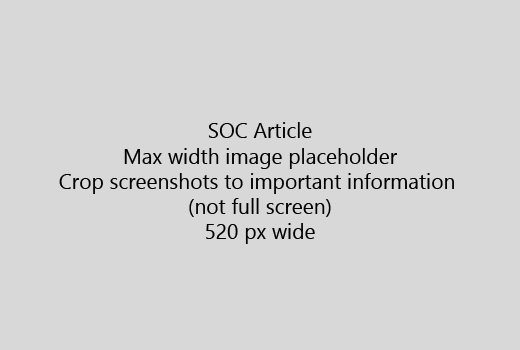

Start artikkelen din med en svært kort introduksjon (1-setning). Sett deg selv i leserens sted - Hvorfor er de her? Hva gjør de? 
  
1. Få direkte til en rask oversikt over trinnene for å fullføre aktiviteten.
    
    Hvis du trenger å forklare et konsept, eller de har å gjøre nødvendige trinn, kan du legge til et raskt sammendrag under trinn der de trenger, og [koblingen](https://support.office.com/article/f37e7984-cf03-4fde-92d3-82970d7e241b.aspx) til konsept eller trinn. 
    
2. Hold prosedyrer kort - fortrinnsvis 5 eller færre trinn, ikke mer enn 8.
    
3. Bruk **stilen** for elementer i brukergrensesnittet eller tekst brukerne må skrive inn. 
    
4. Bruk verb velger du, velger, eller angi som handlinger og formatere menyer som **menyen** \> **kommandoen**.
    
5. Du kan også legge til et skjermbilde for konteksten (Hvis UI er vanskelig å finne, eller hvis det er nødvendig for å fullføre oppgaven).
    
    Maksimal bredde: 520 piksler. Bruke et tema som standard, ikke Vis personlig informasjon, og Beskjær for å vise bare det som er relevant. 
    
    
  
Hvis du vil legge til en video eller skjermbilde, bruker et rutenett med to kolonner og har trinnene i venstre og video eller bilde av høyre - se [trinn og video rutenettet eksempel](https://support.office.com/article/14ce8e82-efa0-47f5-bb84-94f078db3dae.aspx). 
  
Mer enn 500 ord for en artikkel som mål.
  
# Eksempel artikkelen

[Endre bildet](https://support.office.com/article/555376e0-1fca-49ba-8434-307a0525c767.aspx)
  

