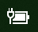

# Strøm- eller batteriikon mangler i Windows 10Power or battery icon missing in Windows 10

Hvis Windows 10-enheten har et batteri (f.eks. en bærbar datamaskin eller et nettbrett eller en PC som er koblet via USB til en UPS), vises vanligvis et strøm/batteri-ikon på oppgavelinjen nær klokken, for eksempel:If your Windows 10 device has a battery (e.g., laptop or tablet, or a PC connected via USB to a UPS), normally a power/battery icon is shown in the taskbar near the clock, for example:

Hvis du ikke ser dette ikonet, kan det være skjult:If you don't see this icon, it may be hidden:

1. Gå til **[Innstillinger > Personalisering > Oppgavelinje](ms-settings:taskbar?activationSource=GetHelp)**.Go to **[Settings > Personalization > Taskbar](ms-settings:taskbar?activationSource=GetHelp)**.

2. I Systemstatusfeltet klikker du på **Velg hvilke ikoner som skal vises på oppgavelinjen**.In the Notification area, click **Select which icons appear on the taskbar**.

3. Finn deretter **Power**-elementet i listen, og veksle innstillingen til **På**.Then find the **Power** item in the list and toggle its setting to **On**.

    

**Feilsøking****Troubleshooting**

Hvis du har fulgt instruksjonene over og **Power**-veksleknappen er nedtonet eller ikke synlig, skriver du inn **Enhetsbehandling** i søkeboksen på oppgavelinjen, og deretter velger du **Enhetsbehandling** i listen over resultater.If you followed the above instructions and the **Power** toggle is greyed out or not visible, in the search box on the taskbar, type **device manager**, and then select **Device Manager** in the list of results. Under **Batterier** høyreklikker du på batteriet for enheten og klikker på **Deaktivere**, og klikker på **Ja**.Under **Batteries**, right-click the battery for your device, click **Disable**, and click **Yes**. Vent noen sekunder og høyreklikk deretter på batteriet og klikk **Aktivere**.Wait a few seconds, and then right-click the battery and click **Enable**. Start deretter enheten på nytt.Then restart your device.

Hvis du har fulgt instruksjonene over, men batteriikonet ikke vises på oppgavelinjen, skriver du inn **oppgavebehandling** i søkeboksen på oppgavelinjen, og klikker deretter **Oppgavebehandling** i listen over resultater.If you followed the above instructions, but the battery icon does not appear on the taskbar, in the search box on the taskbar, type **task manager**, and then click **Task Manager** in the list of results. Gå til **Prosesser** -fanen under **Navn**, høyreklikk på **Explorer**, og klikk deretter på **Start**.On the **Processes** tab, under **Name**, right-click **Explorer**, and then click **Restart**.
