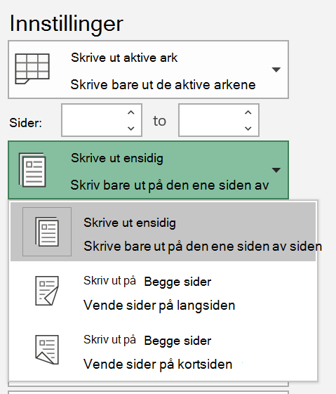
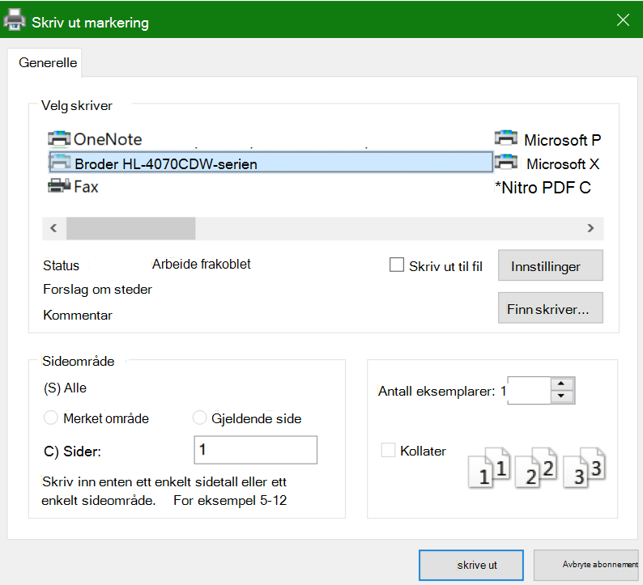

# Skrive ut på begge sider av arket (dobbeltsidig utskrift)

**Kan skrive ren min støtte for dobbeltsidig utskrift?**

Skrive rens funksjons Sammendrag eller manuell skal fortelle deg om det er mulig å skrive ut på begge sider av papiret, også kalt dobbeltsidig utskrift. Hvis du har Microsoft Office, kan du bruke en annen måte å finne ut det på, ved å åpne et Office-program som Word eller Excel, gå til **fil > Skriv ut**, kontrollere at riktig skriver er valgt, og søke etter funksjonen i innstillinger-delen. Eksempel: 

**Dobbeltsidig utskrift i Microsoft Office**

Hvis skrive ren er i stand til å skrive ut på begge sider, vil du se et alternativ for å skrive ut på begge sider når du går til **fil > skrive ut** i Office-appen, som vist i eksemplet ovenfor.  Velg hvilken type dobbeltsidig utskrift du vil bruke (Vend på lang siden, eller Vend på korts IDen), og klikk **Skriv ut** for å starte utskriften.

**Dobbeltsidig utskrift fra et hvilket som helst program**

I mange apper når du skriver ut, vises det en generell utskrifts dialog boks som ser slik ut: 

Kontroller at riktig skriver er valgt, og klikk deretter **Innstillinger** for å åpne vinduet for utskrifts innstillinger. Hvis skrive ren er i stand til dobbeltsidig utskrift, vises funksjonen for å aktivere dette for gjeldende utskrifts jobb i dette vinduet.
