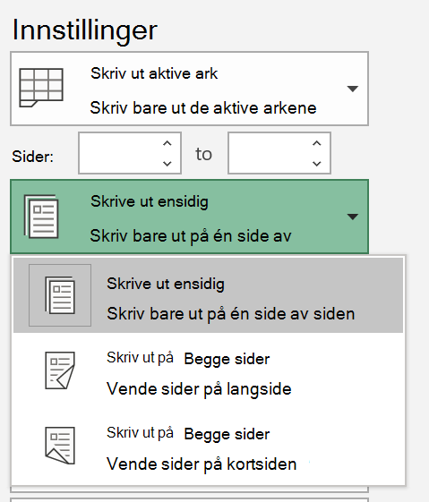

# Skrive ut på begge sider av papiret (dobbeltsidig utskrift)

**Er skriveren min i stand til dobbeltsidig utskrift?**

Skriverens funksjonssammendrag eller brukerhåndbok bør fortelle deg om den er i stand til å skrive ut på begge sider av papiret, også kalt dobbeltsidig utskrift. Hvis du har Microsoft Office, er en annen måte å finne det ut på ved å åpne en Office-app som Word eller Excel, gå til Fil **>** Skriv ut, kontrollere at riktig skriver er valgt, og se etter funksjonaliteten i Innstillinger-delen. For eksempel, 

**Dobbeltsidig utskrift i Microsoft Office**

Hvis skriveren er i stand til å skrive ut på begge sider, vil du se alternativet Skriv ut på begge sider når du går til Fil **>** Skriv ut i Office-app, som vist i eksemplet ovenfor.  Velg typen dobbeltsidig utskrift du vil bruke (vend på langsiden, eller vend på kortsiden), og klikk Skriv ut for å starte utskriften. 

**Dobbeltsidig utskrift fra et hvilket som helst program**

I mange apper når du skriver ut, ser du en generell utskriftsdialogboks som ser slik ut: 

Kontroller at riktig skriver er valgt, og klikk deretter **Innstillinger for** å åpne vinduet for skriverinnstillinger. Hvis skriveren kan dobbeltsidig utskrift, vises muligheten til å aktivere dette for den gjeldende utskriftsjobben i dette vinduet.
