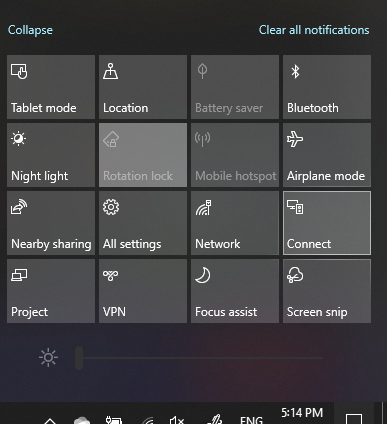

# Prosjekt til en PC

På målenheten (Projiser til), søker du etter «projeksjons innstillinger» for å åpne innstillings siden for **projisering på denne PC**-en. Kontroller deretter at:
- Noen Windows-og Android-enheter kan projisere til denne PC-en når du sier at rulle gardin menyen OK er satt til **alltid**.
- Rulle gardin menyen «spør om Project til denne PC-en» er satt til **hver gang en tilkobling er nødvendig**.
- Rulle gardin menyen Krev feste for sammenkobling er angitt til **aldri**.

Start **tilkoblings** programmet på målenheten ved å gå til **Start** og søk etter «koble til».

Klikk deretter på kilde enheten du prøver å projisere fra:

1. Trykk **Windows-tasten + A** for å åpne handlings senteret.
2. Klikk **Koble til**.
3. Klikk på enheten du vil projisere skjermen til.

Etter trinnene ovenfor skal målenheten vise skjermen til kilde enheten som om den er en sekundær skjerm.
