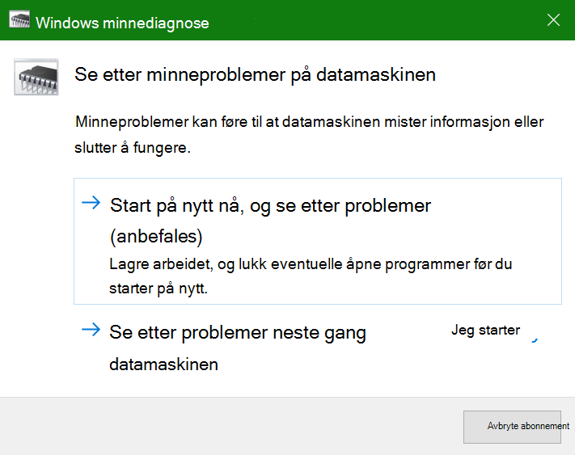
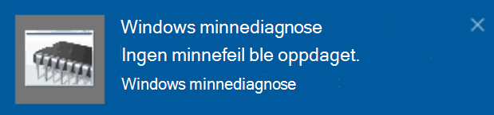

# Kjøre Windows-minnediagnostikk i Windows 10

Hvis Windows og apper på PCen krasjer, fryser eller opptrer på en ustabil måte, kan du ha et problem med PCens minne (RAM). Du kan kjøre Windows Memory Diagnostic for å se etter problemer med PCens RAM.

Skriv inn diagnose av **minne**i søkeboksen på oppgavelinjen, og velg deretter **Windows Memory Diagnostic**. 

For å kjøre diagnose, må PCen starte på nytt. Du har muligheten til å starte på nytt umiddelbart (vennligst lagre arbeidet og lukk åpne dokumenter og e-post først), eller planlegge at diagnoseenheten skal kjøres automatisk neste gang PCen starter på nytt:

Når PCen starter på nytt, **kjøres Diagnoseverktøyet for Windows-minne** automatisk. Status og fremdrift vises når diagnostikken kjøres, og du har muligheten til å avbryte diagnostikken ved å trykke **ESC-tasten** på tastaturet.

Når diagnostikken er fullført, starter Windows normalt.
Umiddelbart etter omstart, når skrivebordet vises, vises et varsel (ved siden av **Handlingssenter-ikonet** på oppgavelinjen), for å angi om det ble funnet minnefeil. For eksempel,

Her er Handlingssenter-ikonet:  

Og et eksempelvarsel: 

Hvis du har gått glipp av varselet, kan du velge **Handlingssenter-ikonet** på oppgavelinjen for å vise **handlingssenteret** og se en rullbar liste over varsler.

Hvis du vil se gjennom detaljert informasjon, skriver du inn **hendelse** i søkeboksen på oppgavelinjen, og deretter velger du **Hendelsesliste**. I ruten til venstre for **Hendelsesliste** **navigerer**du til Windows Logger > System . I ruten til høyre skanner du ned listen **Source** mens du ser på Kilde-kolonnen, til du ser hendelser med **minnediagnoseresultater**for kildeverdi . Merk hver slik hendelse, og se resultatinformasjonen i boksen under **Kategorien Generelt** under listen.
