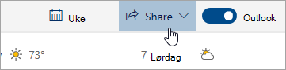

# Dele med Outlook på nettet

1. Velg Kalender nederst på siden for å gå til Kalender.

2. Velg **Del**på verktøylinjen øverst på siden i Kalender, og velg kalenderen du vil dele. 

    

    **Merk:** Du kan ikke dele kalendere som eies av andre personer.

3. Skriv inn navnet eller e-postadressen til personen du vil dele kalenderen med.

4. Velg hvordan du vil at personen skal bruke kalenderen: 
    - **Kan vise når jeg er opptatt**   lar dem se når du er opptatt, men ikke inneholder detaljer som arrangementsstedet. 
    - **Kan vise titler og steder**   lar dem se når du er opptatt, samt tittelen og plasseringen av hendelser. 
    - **Kan vise alle detaljer**   lar dem se alle detaljene i hendelsene dine. 
    - **Kan redigere**   lar dem redigere kalenderen din. 
    - **Delegere**   lar dem redigere kalenderen din og dele den med andre.

5. Velg **Del**. Hvis du bestemmer deg for ikke å dele kalenderen din akkurat nå, velger du **Fjern**. 

**Merknader**:  

- Når du deler kalenderen med noen som ikke bruker Outlook på nettet, for eksempel noen som bruker Gmail, kan de bare godta invitasjonen ved hjelp av en Microsoft 365- eller Outlook.com-konto. 

- ICS-kalendere er skrivebeskyttede, så selv om du gir redigeringstilgang til andre personer, kan de ikke redigere kalenderen din. 

- Hvor ofte ICS-kalenderen din synkroniseres, avhenger av e-postleverandøren til personen du har delt den med. 

- Kalenderelementer som er merket som private, er beskyttet. De fleste du deler kalenderen din med, ser bare tidspunktet for elementer som er merket privat, ikke tittelen, plasseringen eller andre detaljer. Regelmessige serier merket som private vil også vise gjentakelsesmønsteret.
