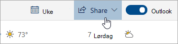

# Dele med Outlook på nettetSharing with Outlook on the web

Velg **Del**på verktøylinjen øverst på siden i kalenderen, og velg kalenderen du vil dele.From your Calendar, on the toolbar at the top of the page, select **Share**, and choose the calendar you want to share.

    

**Merk:** Du kan ikke dele kalendere som eies av andre personer.**Note**: You can't share calendars owned by other people.

- Skriv inn navnet eller e-postadressen til personen du vil dele kalenderen med.Enter the name or email address of the person you want to share your calendar with.
- Velg hvordan du vil at personen skal bruke kalenderen:Choose how you want the person to use your calendar:
    - **Kan vise når jeg er opptatt**   lar dem se når du er opptatt, men ikke inneholder detaljer som arrangementsstedet.**Can view when I'm busy** lets them see when you're busy but doesn't include details like the event location.
    - **Kan vise titler og steder**   lar dem se når du er opptatt, samt tittelen og plasseringen av hendelser.**Can view titles and locations** lets them see when you're busy, as well as the title and location of events.
    - **Kan vise alle detaljer**   lar dem se alle detaljene i hendelsene dine.**Can view all details** lets them see all the details of your events.
    - **Kan redigere**   lar dem redigere kalenderen din.**Can edit** lets them edit your calendar.
    - **Delegere**   kan du redigere kalenderen din og dele den med andre.**Delegate** lets them edit your calendar and share it with others.
- Velg **Del**.Select **Share**.
