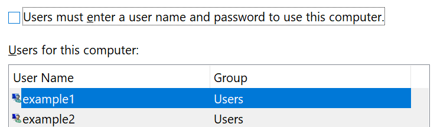

# Logge på Windows 10 uten å bruke et passordSign-in to Windows 10 without using a password

Vi anbefaler at du bruker et av alternativene for sikker pålogging for Windows Hello, for eksempel en PIN-kode, et ansikts gjenkjenning eller finger avtrykk, hvis det er tilgjengelig for å unngå å måtte skrive inn et passord på Windows-oppstart.To avoid having to type a password at Windows startup, we recommend you use one of the Windows Hello secure sign-in options, like a PIN, face recognition, or fingerprint, if available. Hvis du virkelig vil deaktivere sikker pålogging, kan du se instruksjonene automatisk Logg på Windows 10 nedenfor.If you really want to disable secure sign-in, see the "Automatically sign in to Windows 10" instructions below.

**Sikre Windows Hello-alternativer til konto passordet****Secure Windows Hello alternatives to the account password**

Gå til **innstillinger > kontoer > påloggings alternativer** (eller klikk [her](ms-settings:signinoptions?activationSource=GetHelp)).Go to **Settings  > Accounts > Sign-in options** (or click [here](ms-settings:signinoptions?activationSource=GetHelp)). Tilgjengelige påloggings alternativer vil være oppført.Available sign-in options will be listed. Eksempel:For example:

Klikk eller trykk et av alternativene for å konfigurere det.Click or tap one of the options to configure it. Neste gang du starter eller låser opp Windows, vil du kunne bruke det nye alternativet i stedet for et passord.Next time you start or unlock Windows, you will be able to use the new option instead of a password. 

**Logge på Windows 10 automatisk****Automatically sign-in to Windows 10**

**Obs**! automatisk pålogging er praktisk, men introduserer en sikkerhets risiko, spesielt hvis PC-en er tilgjengelig for flere personer.**Note**: Automatic sign-in is convenient, but introduces a security risk, especially if your PC is accessible by multiple people. 

1. Klikk eller trykk **Start** -knappen på oppgave linjen.Click or tap the **Start** button in the Taskbar.

2. Skriv inn **NETPLWIZ** , og trykk Enter-tasten for å åpne Brukerkontoer-vinduet.Type **netplwiz** and hit the Enter key to open the User Accounts window.

3. Klikk kontoen du vil logge på automatisk når Windows starter, i **bruker kontoer**.In **User Accounts**, click the account you want to automatically sign in to when Windows starts.

4. Fjern merket i avmerkings boksen brukere må angi et bruker navn og passord for å bruke denne data maskinen.Uncheck the "Users must enter a user name and password to use this computer" checkbox.

    

5. Klikk **OK**.Click **OK**. Du blir bedt om å skrive inn og bekrefte passordet for kontoen du valgte.You will be asked to enter and confirm the password for the account you selected. Klikk **OK** for å fullføre.Click **OK** to finish. Neste gang Windows 10 starter, vil den automatisk logge på kontoen du valgte.Next time Windows 10 starts, it will automatically sign in to the account you selected.
