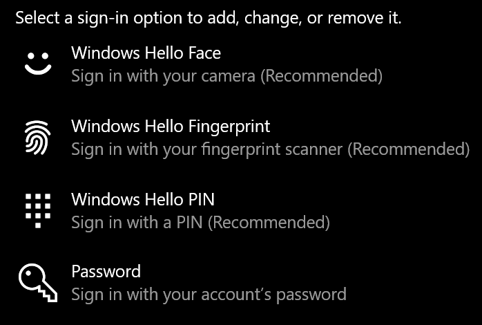

# Logge på Windows 10 uten å bruke et passord

Hvis du vil unngå å måtte skrive inn et passord ved oppstart av Windows, anbefaler vi at du bruker et av windows Hello-sikre påloggingsalternativene, for eksempel en PIN-kode, ansiktsgjenkjenning eller fingeravtrykk, hvis tilgjengelig. Hvis du virkelig vil deaktivere sikker pålogging, kan du se instruksjonene "Logg på Windows 10 automatisk" nedenfor.

**Sikre Windows Hello-alternativer til kontopassordet**

Gå til **Innstillinger > Kontoer > Påloggingsalternativer** (eller klikk [her).](ms-settings:signinoptions?activationSource=GetHelp) Tilgjengelige påloggingsalternativer vises. Eksempel:

Klikk eller trykk på ett av alternativene for å konfigurere det. Neste gang du starter eller låser opp Windows, kan du bruke det nye alternativet i stedet for et passord. 

**Logge på Windows 10 automatisk**

**Merk:** Automatisk pålogging er praktisk, men introduserer en sikkerhetsrisiko, spesielt hvis PCen er tilgjengelig av flere personer. 

1. Klikk eller trykk **startknappen** på oppgavelinjen.

2. Skriv inn **netplwiz,** og trykk på Enter-tasten for å åpne Brukerkontoer-vinduet.

3. Klikk kontoen du vil logge på automatisk når Windows starter, i **Brukerkontoer.**

4. Fjern merket for "Brukere må skrive inn et brukernavn og passord for å bruke denne datamaskinen".

    

5. Klikk på **OK**. Du vil bli bedt om å skrive inn og bekrefte passordet for kontoen du valgte. Klikk **OK** for å fullføre. Neste gang Windows 10 starter, logger den automatisk på kontoen du valgte.
