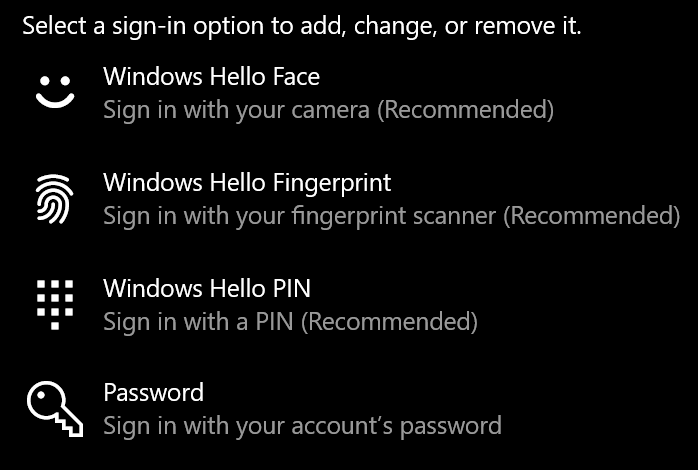
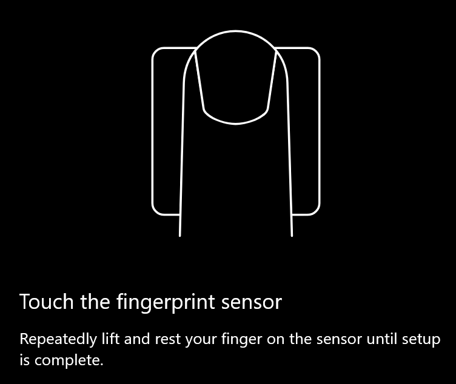
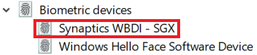

# Bruke alternativet for opplåsing av fingeravtrykk i Windows 10

**Aktiver Windows Hello-fingeravtrykk**

Hvis du vil låse opp Windows 10 ved hjelp av fingeravtrykket ditt, må du konfigurere Windows Hello Fingerprint ved å legge til (la Windows lære å gjenkjenne) minst én finger. 

1. Gå til **Innstillinger > Kontoer > Påloggingsalternativer** (eller klikk [her).](ms-settings:signinoptions?activationSource=GetHelp) Tilgjengelige påloggingsalternativer vises. Eksempel:

    

2. Klikk eller trykk **Windows Hello Fingeravtrykk**, og klikk deretter **Konfigurer**. Klikk **Kom i gang**i vinduet Installasjonsprogram for Windows Hello . Fingeravtrykkssensoren aktiveres, og du blir bedt om å plassere fingeren på sensoren:

   

3. Følg instruksjonene, som vil be deg om å skanne fingeren gjentatte ganger. Når dette er ferdig, har du muligheten til å legge til andre fingre du kanskje vil bruke til pålogging. Neste gang du logger på Windows 10, har du muligheten til å bruke fingeravtrykket til å gjøre det.

**Windows Hello Fingeravtrykk er ikke tilgjengelig som påloggingsalternativ**

Hvis Windows Hello Fingeravtrykk ikke vises som et alternativ i **påloggingsalternativer**, betyr det at Windows ikke er klar over fingeravtrykksleser/skanner som er koblet til PCen, eller at en systempolicy forhindrer bruk (hvis pCen for eksempel administreres av arbeidsplassen din). Slik feilsøker du: 

1. Velg **Start-knappen** på oppgavelinjen, og søk etter **Enhetsbehandling**.

2. Klikk eller trykk for å åpne **Enhetsbehandling**.

3. Utvid Biometriske enheter i Enhetsbehandling ved å klikke på vinkeltegnet.

   

4. Fingeravtrykkskanneren skal være oppført som en biometrisk enhet, for eksempel Synaptics WBDI-skanneren:

   

5. Hvis fingeravtrykkskanneren ikke vises, og skanneren er integrert i PCen, går du til PC-produsentens nettsted. I delen teknisk støtte for PC-modellen søker du etter en Windows 10-driver etter en skanner du kan installere.

6. Hvis skanneren er atskilt fra PC-en (tilkoblet via USB), går du til skannerprodusentens nettsted for å finne og installere Windows 10-enhetsdriverprogramvare for skannermodellen du har.
