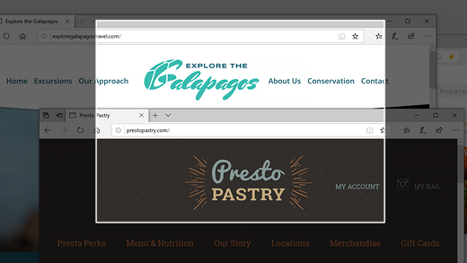
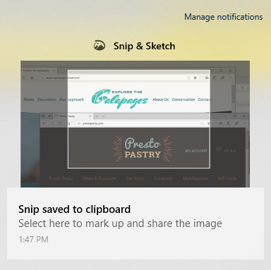

# Bruk Klipp & Sketch til å ta opp, markere og dele bilder

Skjermskisse kalles nå **Klipp & Sketch**. **Slik tar du raskt et klipp**:

1. Trykk **Windows-logotasten + Skift + S**. Du ser skjermen mørkere og markøren vises som et kors. 

2. Velg et punkt på kanten av området du vil kopiere, og klikk markøren til venstre. 

3. Flytt markøren for å utheve området du vil ta opp. Området du tar opp, vises på skjermen.

   

Bildet du klippet, lagres på utklippstavlen, klar til å lime inn i en e-post eller et dokument. 

**Hvis du vil redigere eller vise bildet**: 

- Klikk på varslingsikonet helt til høyre på oppgavelinjen. klikk deretter på bildet du nettopp har tatt. Klippet åpnes i Klipp & Sketch-appen.

   
