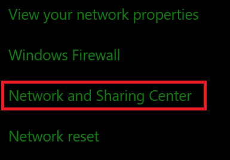
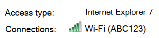
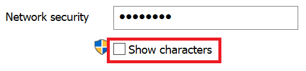

# Vise Wi-Fi nettverkspassord i Windows 10View Wi-Fi network password in Windows 10

1. Kontroller at Windows 10-PC-en er koblet til Wi-Fi nettverket.Make sure your Windows 10 PC is connected to the Wi-Fi network.

2. Gå til **Innstillinger > Network & Internet > Status**, eller  klikk eller trykk her for å la oss ta deg dit nå.)Go to **Settings  > Network & Internet  > Status**, or click or tap [here](ms-settings:network?activationSource=GetHelp) to let us take you there now.)

3. Klikk **Nettverks- og delingssenter**.Click **Network and Sharing Center**.

    

4. Ved **siden av** **Tilkoblinger** i Nettverks- og delingssenter ser du navnet på det trådløse nettverket.In **Network and Sharing Center**, next to **Connections**, you will see the name of your wireless network. Hvis nettverket for eksempel heter ABC123, kan du se:For example, if your network is named "ABC123," you might see:

    

    Klikk navnet på det trådløse nettverket for å åpne Wi-Fi Status-vinduet.Click the wireless network name to open the Wi-Fi Status window. 

5. Klikk trådløse Wi-Fi i **statusvinduet,** klikk **Sikkerhet-fanen,** og merk av for Vis **tegn**.In the Wi-Fi Status window, click **Wireless Properties**, click the **Security** tab, and check **Show characters**.

    

