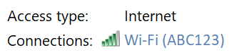

# Vise passord for Wi-Fi-nettverk i Windows 10

1. Kontroller at Windows 10-PC-en er koblet til Wi-Fi-nettverket.

2. Gå til **innstillinger > nettverks & status for Internet t >**, eller klikk eller trykk [her](ms-settings:network?activationSource=GetHelp) for å la oss ta deg med det nå.)

3. Klikk **nettverks-og Delings senter**.

    

4. Ved siden av **tilkoblinger**i **nettverks-og Delings senter**, vil du se navnet på det trådløse nettverket. Hvis nettverket for eksempel heter "ABC123", kan du se:

    

    Klikk navnet på det trådløse nettverket for å åpne vinduet for Wi-Fi-status. 

5. Klikk **trådløs egenskaper**i Wi-Fi-status vinduet, klikk **sikkerhet** -fanen, og Merk av for **Vis tegn**.

    

