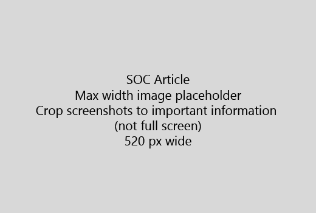

Start artikkelen din med en svært kort introduksjon (1-setning). Sett deg selv i leserens sted - Hvorfor er de her? Hva gjør de?Start your article with a very short introduction (1 sentence). Put yourself in the reader's place - why are they here? What should they do? 
  
1. Få direkte til en rask oversikt over trinnene for å fullføre aktiviteten.Get straight to a quick list of steps to accomplish the task.
    
    Hvis du trenger å forklare et konsept, eller de har å gjøre nødvendige trinn, kan du legge til et raskt sammendrag under trinn der de trenger, og [koblingen](https://support.office.com/article/f37e7984-cf03-4fde-92d3-82970d7e241b.aspx) til konsept eller trinn.If you need to explain a concept, or they have to do pre-requisite steps, add a quick summary below the step where they need it, and [link](https://support.office.com/article/f37e7984-cf03-4fde-92d3-82970d7e241b.aspx) to the concept or steps. 
    
2. Hold prosedyrer kort - fortrinnsvis 5 eller færre trinn, ikke mer enn 8.Keep procedures short - preferably 5 or fewer steps, no more than 8.
    
3. Bruk **stilen** for elementer i brukergrensesnittet eller tekst brukerne må skrive inn.Use **Ui style** for user interface elements or for text people need to enter. 
    
4. Bruk verb velger du, velger, eller angi som handlinger og formatere menyer som **menyen** \> **kommandoen**.Use the verbs choose, select, or enter as actions, and format menus as **Menu** \> **Command**.
    
5. Du kan også legge til et skjermbilde for konteksten (Hvis UI er vanskelig å finne, eller hvis det er nødvendig for å fullføre oppgaven).Optionally, add a screenshot for context (if UI is hard to locate, or it's needed to complete the task).
    
    Maksimal bredde: 520 piksler. Bruke et tema som standard, ikke Vis personlig informasjon, og Beskjær for å vise bare det som er relevant.Maximum width: 520 pixels. Use a standard theme, do not show any personal information, and crop to show only what's relevant. 
    
    
  
Hvis du vil legge til en video eller skjermbilde, bruker et rutenett med to kolonner og har trinnene i venstre og video eller bilde av høyre - se [trinn og video rutenettet eksempel](https://support.office.com/article/14ce8e82-efa0-47f5-bb84-94f078db3dae.aspx).If you want to add a video or screenshot, use a two-column grid and have the steps in the left and the video or screenshot in the right - see [Steps and video grid example](https://support.office.com/article/14ce8e82-efa0-47f5-bb84-94f078db3dae.aspx). 
  
Mer enn 500 ord for en artikkel som mål.Target no more than 500 words for an article.
  
# Eksempel artikkelenExample article

[Endre bildetChange my photo](https://support.office.com/article/555376e0-1fca-49ba-8434-307a0525c767.aspx)
  

